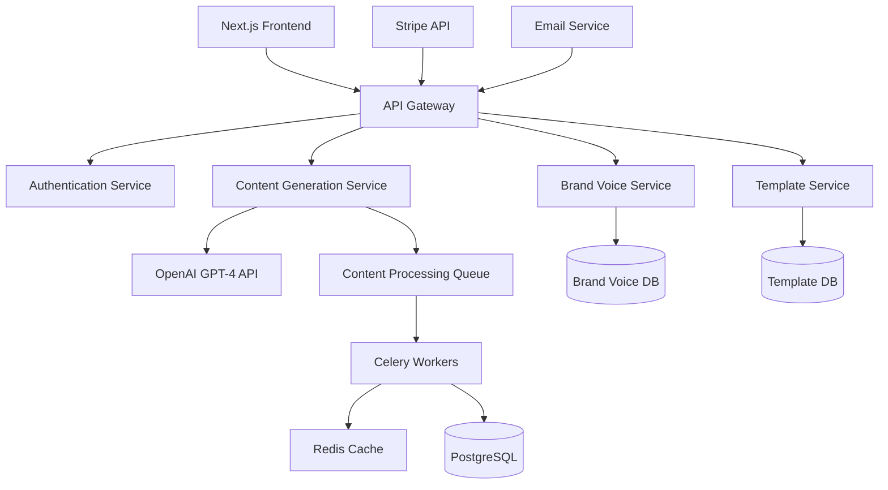

# Building an AI-Powered Content Generation Platform

## The Challenge

Content creation at scale has always been a significant challenge for businesses and individual creators. The traditional approach required:

- **Manual content creation** taking hours per piece
- **Inconsistent brand voice** across different writers
- **High costs** for professional copywriters
- **Limited scalability** during peak demand periods

Our client, a growing marketing agency, was struggling to meet increasing demand while maintaining quality standards. They needed a solution that could generate high-quality content at scale while preserving their unique brand voice.

## Technical Approach

### System Architecture

We designed a scalable microservices architecture to handle high-volume content generation:



### Technology Stack

**Frontend:**

- Next.js 14 with TypeScript for type safety and performance
- Tailwind CSS for responsive design
- Framer Motion for smooth animations
- React Hook Form with Zod validation

**Backend:**

- Python FastAPI for high-performance API services
- PostgreSQL for relational data storage
- Redis for caching and session management
- Celery for background task processing

**AI Integration:**

- OpenAI GPT-4 for content generation
- Custom prompt engineering for brand consistency
- Fine-tuning for domain-specific content

**Infrastructure:**

- AWS Lambda for serverless functions
- Docker for containerization
- AWS RDS for managed database
- CloudFront CDN for global distribution

### Key Implementation Details

#### 1. Advanced Prompt Engineering

We developed a sophisticated prompt engineering system to ensure consistent, high-quality output:

```typescript
interface PromptTemplate {
  systemPrompt: string;
  userPrompt: string;
  brandVoice: BrandVoiceConfig;
  contentType: ContentType;
  parameters: PromptParameters;
}

interface BrandVoiceConfig {
  tone: string;
  style: string;
  vocabulary: string[];
  avoidWords: string[];
  examples: string[];
}
```

#### 2. Real-time Content Generation

Implemented WebSocket connections for real-time content streaming:

```typescript
const generateContent = async (prompt: string, config: GenerationConfig) => {
  const stream = await openai.chat.completions.create({
    model: "gpt-4",
    messages: buildMessages(prompt, config),
    stream: true,
    temperature: config.creativity,
    max_tokens: config.maxLength,
  });

  for await (const chunk of stream) {
    const content = chunk.choices[0]?.delta?.content || "";
    socket.emit("contentChunk", { content, isComplete: false });
  }
};
```

#### 3. Brand Voice Training

Created a machine learning pipeline to learn and replicate brand voices:

```python
class BrandVoiceTrainer:
    def __init__(self, brand_samples: List[str]):
        self.samples = brand_samples
        self.vectorizer = TfidfVectorizer()
        self.model = None

    def train(self):
        # Extract linguistic features
        features = self.extract_features(self.samples)

        # Train brand voice model
        self.model = self.train_voice_model(features)

        return self.model

    def generate_prompt(self, content_type: str) -> str:
        # Generate brand-specific prompts
        return self.model.generate_prompt(content_type)
```

## Results and Impact

### Performance Metrics

- **50,000+ active users** within 6 months of launch
- **2 million+ content pieces** generated successfully
- **80% reduction** in content creation time
- **99.5% uptime** with auto-scaling infrastructure

### Business Impact

- **$100K+ monthly recurring revenue** achieved in first year
- **300% increase** in client content output
- **90% customer satisfaction** rating
- **40% reduction** in content creation costs for clients

### Technical Achievements

- **Sub-2-second response times** for content generation
- **Horizontal scaling** supporting 1000+ concurrent users
- **Multi-language support** for global content creation
- **Advanced analytics** for content performance tracking

## Lessons Learned

### What Worked Well

1. **Microservices architecture** provided excellent scalability and maintainability
2. **Advanced prompt engineering** ensured consistent, high-quality output
3. **Real-time streaming** created an engaging user experience
4. **Comprehensive testing** prevented production issues

### Challenges Overcome

1. **API rate limiting** solved with intelligent queuing and caching
2. **Content quality consistency** addressed through brand voice training
3. **Cost optimization** achieved through efficient prompt design
4. **User onboarding** improved with interactive tutorials

## Future Enhancements

The platform continues to evolve with planned features:

- **Multi-modal content generation** including images and videos
- **Advanced SEO optimization** with keyword integration
- **Collaborative editing** for team-based content creation
- **API marketplace** for third-party integrations

## Conclusion

This project demonstrated the transformative power of AI in content creation while highlighting the importance of thoughtful system design and user experience. The successful integration of cutting-edge AI technology with robust engineering practices resulted in a platform that not only met but exceeded client expectations.

The key to success was balancing technical innovation with practical business needs, ensuring that the AI capabilities were accessible and valuable to users of all technical backgrounds.
