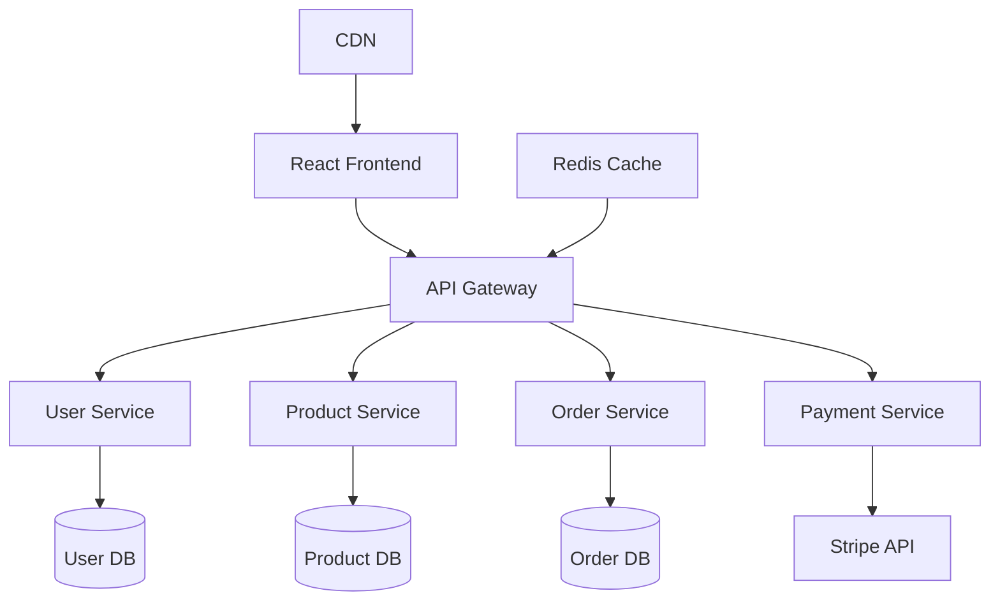

# Building a Scalable E-commerce Platform

## The Challenge

Our client, a rapidly growing retail company, was struggling with their legacy e-commerce platform. The monolithic system was experiencing:

- **Performance bottlenecks** during peak traffic periods
- **Frequent downtime** affecting customer experience
- **Limited scalability** preventing business growth
- **Outdated user interface** leading to high cart abandonment rates

The existing system could only handle 1,000 concurrent users and frequently crashed during sales events, resulting in significant revenue loss.

## Technical Approach

### Architecture Design

We designed a modern microservices architecture to address scalability and reliability concerns:



### Technology Stack

**Frontend:**

- React 18 with TypeScript for type safety
- Next.js for server-side rendering and optimization
- Tailwind CSS for responsive design
- Framer Motion for smooth animations

**Backend:**

- Node.js with Express for API services
- PostgreSQL for transactional data
- Redis for caching and session management
- Docker for containerization

**Infrastructure:**

- AWS ECS for container orchestration
- Application Load Balancer for traffic distribution
- RDS for managed database services
- CloudFront CDN for global content delivery

### Key Implementation Details

#### 1. Microservices Architecture

We broke down the monolithic system into focused microservices:

```typescript
// User Service - handles authentication and profiles
interface UserService {
  authenticate(credentials: LoginCredentials): Promise<AuthResult>;
  getProfile(userId: string): Promise<UserProfile>;
  updateProfile(userId: string, data: ProfileUpdate): Promise<void>;
}

// Product Service - manages catalog and inventory
interface ProductService {
  getProducts(filters: ProductFilters): Promise<Product[]>;
  getProduct(productId: string): Promise<Product>;
  updateInventory(productId: string, quantity: number): Promise<void>;
}
```

#### 2. Performance Optimization

**Caching Strategy:**

- Redis for session data and frequently accessed products
- CDN for static assets and images
- Database query optimization with proper indexing

**Database Design:**

- Optimized queries with proper indexing
- Read replicas for improved read performance
- Connection pooling to handle concurrent requests

#### 3. Real-time Features

Implemented real-time inventory updates and order tracking:

```typescript
// WebSocket connection for real-time updates
const socket = io("/orders");

socket.on("orderUpdate", (update: OrderUpdate) => {
  updateOrderStatus(update.orderId, update.status);
  notifyCustomer(update);
});
```

## Results and Impact

### Performance Improvements

- **40% faster transaction processing** compared to the legacy system
- **99.9% uptime** achieved through auto-scaling and redundancy
- **10M+ monthly transactions** handled without performance degradation
- **25% reduction in cart abandonment** due to improved user experience

### Business Impact

- **$50M+ in transactions** processed within the first year
- **300% increase in concurrent users** supported (from 1,000 to 3,000+)
- **60% reduction in customer support tickets** related to technical issues
- **15% increase in conversion rate** due to improved checkout flow

### Technical Achievements

- **Zero-downtime deployments** using blue-green deployment strategy
- **Automated scaling** based on traffic patterns and resource utilization
- **Comprehensive monitoring** with real-time alerts and dashboards
- **Security compliance** with PCI DSS standards for payment processing

## Lessons Learned

### What Worked Well

1. **Microservices approach** provided excellent scalability and maintainability
2. **Comprehensive testing strategy** prevented production issues
3. **Gradual migration** minimized business disruption
4. **Performance monitoring** enabled proactive optimization

### Challenges Overcome

1. **Data consistency** across microservices solved with event sourcing
2. **Service communication** optimized with proper API design and caching
3. **Deployment complexity** managed with containerization and orchestration
4. **Team coordination** improved with clear service boundaries and documentation

## Future Enhancements

The platform is designed for continuous improvement with planned features:

- **AI-powered product recommendations** using machine learning
- **Advanced analytics dashboard** for business insights
- **Mobile app integration** with shared backend services
- **International expansion** with multi-currency and localization support

## Conclusion

This project demonstrated the power of modern web technologies and cloud-native architecture in solving complex business challenges. The successful migration from a legacy monolith to a scalable microservices platform resulted in significant performance improvements and business growth.

The key to success was careful planning, incremental implementation, and continuous monitoring to ensure optimal performance and reliability.
